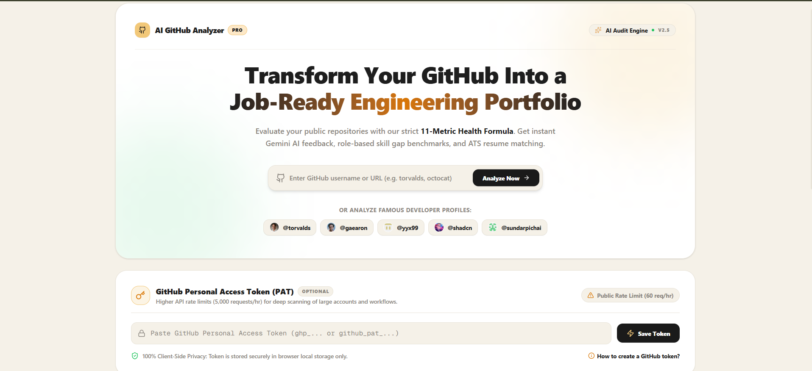
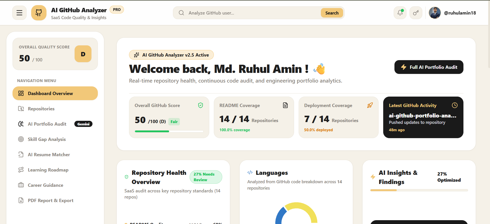
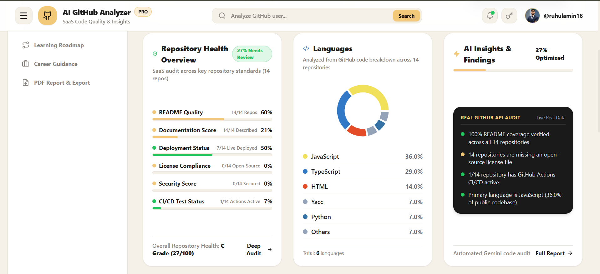
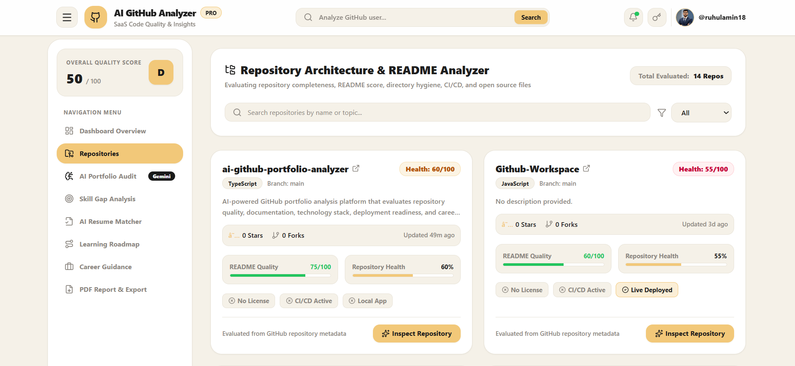
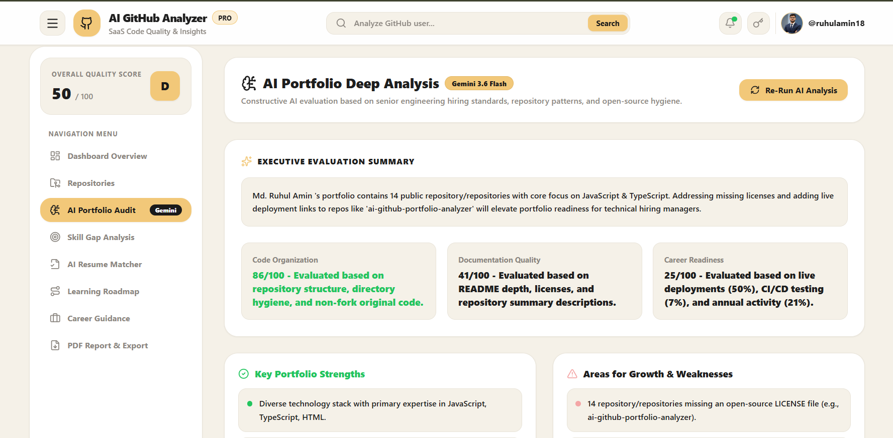
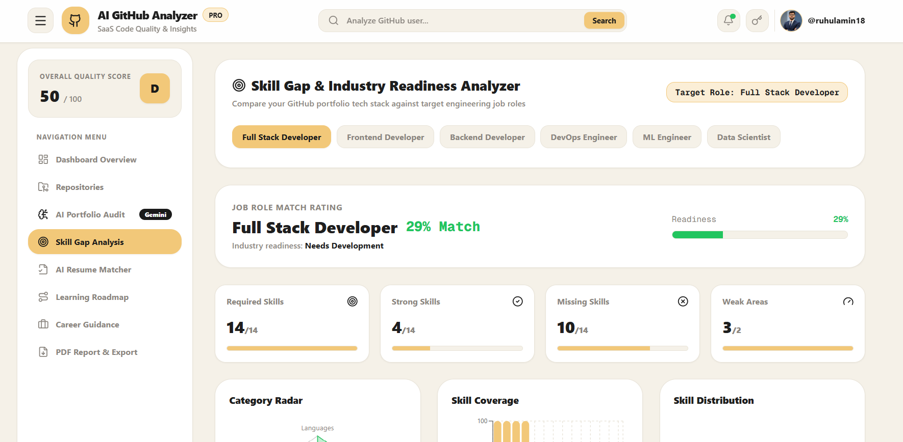
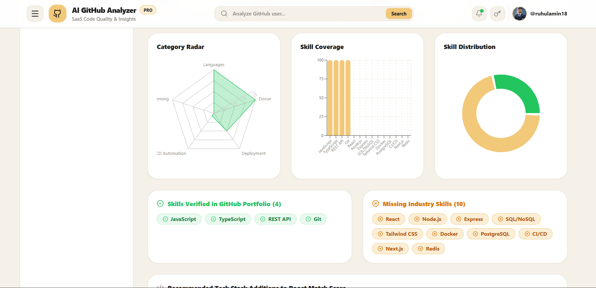
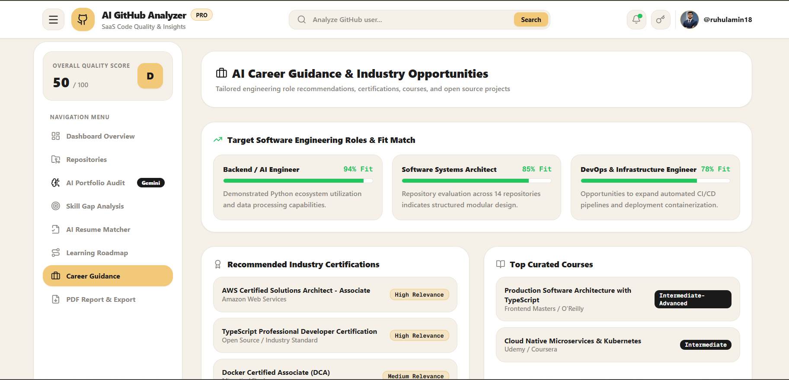
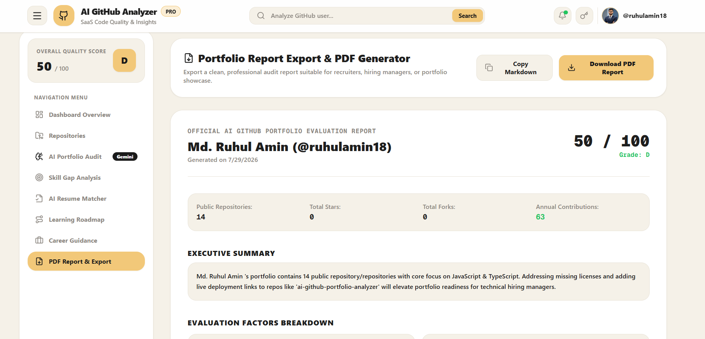

# 🚀 AI GitHub Portfolio Analyzer

> **An AI-powered GitHub portfolio analysis platform that evaluates developer profiles, analyzes repository quality, detects skill gaps, matches resumes with GitHub projects, and generates personalized career insights using Google Gemini 2.5 Flash.**


---

# 📖 Overview

AI GitHub Portfolio Analyzer is a modern full-stack web application that helps developers evaluate the quality of their GitHub portfolios using real GitHub data and AI-powered insights.

The platform analyzes GitHub repositories, documentation quality, repository health, programming languages, developer activity, and overall portfolio strength. It then generates intelligent reports, identifies skill gaps, compares resumes with GitHub projects, and provides personalized career guidance powered by **Google Gemini 2.5 Flash**.

Whether you're preparing for internships, software engineering positions, or improving your open-source portfolio, this platform provides meaningful insights to help you grow.

---

# ✨ Key Features

## 📊 GitHub Portfolio Dashboard

- Analyze any public GitHub profile
- Overall GitHub Score (0–100)
- Repository statistics
- Language distribution
- Contribution heatmap
- Repository health metrics
- Top repositories
- GitHub activity overview

---

## 🤖 AI Portfolio Analysis

Generate intelligent AI-powered portfolio reports including:

- Technical strengths
- Weaknesses
- Code quality evaluation
- Improvement suggestions
- Portfolio recommendations
- Career insights

Powered by **Google Gemini 2.5 Flash**.

---

## 📈 Repository Health Analysis

Evaluate repository quality using multiple metrics.

Includes:

- README Quality
- Documentation Score
- Repository Quality
- Deployment Status
- License Compliance
- Security Score
- CI/CD Detection

---

## 🎯 Skill Gap Analyzer

Compare your GitHub portfolio with industry job roles.

Supported roles include:

- Frontend Developer
- Backend Developer
- Full Stack Developer
- DevOps Engineer
- Machine Learning Engineer
- Data Scientist

The analyzer provides:

- Skill Match Score
- Missing Skills
- Industry Readiness
- Learning Roadmap
- Recommended Portfolio Projects

---

## 📄 Resume Match Analyzer

Compare your resume with your GitHub portfolio.

Analyze:

- Matched Skills
- Missing Skills
- Missing Projects
- Resume Consistency
- ATS Readiness
- Portfolio Alignment

---

## 🛣 Career Guidance

Receive personalized AI-generated career recommendations.

Includes:

- Career Path Suggestions
- Learning Roadmap
- Certification Recommendations
- Open Source Suggestions
- Industry Preparation Tips

---

# 📊 GitHub Portfolio Scoring System

The platform evaluates GitHub portfolios using an **11-metric weighted scoring model**.

| Metric | Weight |
|---------|--------|
| Repository Quality | 15% |
| README Quality | 15% |
| Documentation Score | 10% |
| Deployment Status | 10% |
| Code Quality | 10% |
| GitHub Activity | 10% |
| Language Diversity | 10% |
| CI/CD Status | 5% |
| Security Score | 5% |
| License Compliance | 5% |
| Open Source Contribution | 5% |

### Performance Levels

| Score | Level |
|--------|----------------|
| 90 – 100 | Outstanding |
| 80 – 89 | Excellent |
| 70 – 79 | Very Good |
| 60 – 69 | Good |
| 50 – 59 | Fair |
| Below 50 | Needs Improvement |

---

# 🖼 Screenshots

<table>
  <tr>
    <td align="center" width="50%">
      <strong>Landing Page</strong><br><br>
      
    </td>
    <td align="center" width="50%">
      <strong>Dashboard Overview</strong><br><br>
      
    </td>
  </tr>

  <tr>
    <td align="center">
      <strong>Language Distribution</strong><br><br>
      
    </td>
    <td align="center">
      <strong>Repository Health Analysis</strong><br><br>
      
    </td>
  </tr>

  <tr>
    <td align="center">
      <strong>AI Portfolio Report</strong><br><br>
      
    </td>
    <td align="center">
      <strong>Skill Gap Analysis</strong><br><br>
      
    </td>
  </tr>

  <tr>
    <td align="center">
      <strong>Industry Readiness Analysis</strong><br><br>
      
    </td>
    <td align="center">
      <strong>Career Guidance</strong><br><br>
      
    </td>
  </tr>

  <tr>
    <td align="center" colspan="2">
      <strong>Final Portfolio Report</strong><br><br>
      
    </td>
  </tr>
</table>

---

# 🏗 System Architecture

```
                    React + TypeScript
                           │
                           ▼
                   Express Backend API
                           │
            ┌──────────────┴──────────────┐
            │                             │
            ▼                             ▼
     GitHub REST API          Google Gemini 2.5 Flash
```

---

# 🛠 Technology Stack

### Frontend

- React 19
- TypeScript
- Tailwind CSS v4
- Recharts
- Motion
- Lucide React

### Backend

- Node.js
- Express.js

### AI

- Google Gemini 2.5 Flash

### APIs

- GitHub REST API

### Utilities

- jsPDF
- html2canvas

---

# 📂 Project Structure

```
src/
│
├── api/
├── components/
├── hooks/
├── server/
├── services/
├── utils/
├── types/
├── App.tsx
└── main.tsx
```

---

# ⚙ Installation

Clone the repository

```bash
git clone https://github.com/ruhulamin18/ai-github-portfolio-analyzer.git
```

Move into the project directory

```bash
cd ai-github-portfolio-analyzer
```

Install dependencies

```bash
npm install
```

Create a `.env` file

```env
GEMINI_API_KEY=your_google_gemini_api_key
PORT=3000
```

Start the development server

```bash
npm run dev
```

Open your browser and visit:

```
http://localhost:3000
```

---

# 🔑 Environment Variables

| Variable | Description |
|----------|-------------|
| GEMINI_API_KEY | Google Gemini API Key |
| PORT | Express Server Port |

---

# 🚀 Future Improvements

- GitHub OAuth Authentication
- Private Repository Analysis
- Team Dashboard
- Organization Analytics
- AI README Generator
- AI Project Recommendations
- Multi-language Support
- Dark Mode

---

# 🤝 Contributing

Contributions are welcome!

1. Fork the repository.
2. Create a new feature branch.

```bash
git checkout -b feature-name
```

3. Commit your changes.

```bash
git commit -m "Add new feature"
```

4. Push the branch.

```bash
git push origin feature-name
```

5. Open a Pull Request.

---

# 📄 License

This project is licensed under the **MIT License**.

---

# 👨‍💻 Author

## Md. Ruhul Amin

**Frontend Developer | Software Engineering Student**

🎓 Bachelor of Science in Computer Science & Engineering

🏛 Daffodil International University

### Connect with Me

- 💻 **GitHub:** https://github.com/ruhulamin18
- 💼 **LinkedIn:** https://www.linkedin.com/in/md-ruhul-amin-r018
- 🌐 **Portfolio:** https://mdruhulamin18.vercel.app

---

# ⭐ Support

If you found this project useful, please consider giving it a **Star ⭐** on GitHub.

Your support helps improve the project and motivates future development.

---

<p align="center">
Made with ❤️ by <strong>Md. Ruhul Amin</strong>
</p>